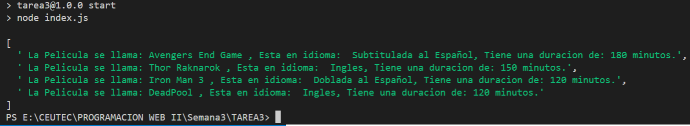

# **Informacion General**

## Descripción

El objetivo de la tarea era desarrolar una aplicación que permita administrar una base de datos de Películas, utilizando clases de javaScript.

## Desarrollo

1. Cree el archivo package.json a partir del siguiente codigo: `npm init`.
2. cree el script de inicio en el pakaje.json colocando `start: index.js`.
3. Cree el archivo **salasCine.js** donde cree la clase y la exporte.
4. En el archivo **salasCine.js** cree la clase **Pelicula** en donde realize el constructor que capturara los datos que enviare desde el **index.js**.

Aunque el maestro pidio solo administrar peliculas, me tome la iniciativa de ir mas alla  y Cree 3 funciones:  
- `informacionSalas()` donde solo se muestra el número de sala y su nombre. 

- `informacionPeliculas()` donde se muestra solo la informacion de la pelicula como ser nombre, duracion, idioma.

- `cartelera()` donde se muestra una cartelera como tal, con el nombre de la sala, la hora de funcion, el nombre de la pelicula y su idioma.

